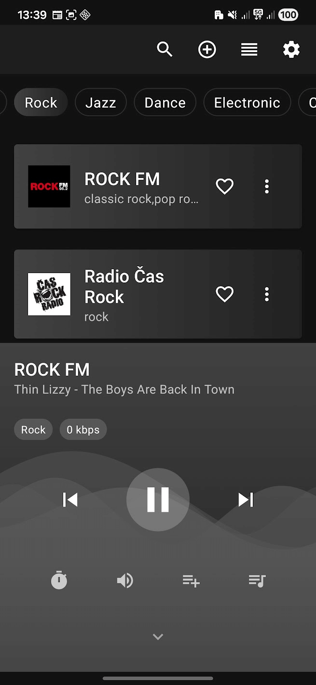

# Touch Radio 📻

A modern Android application for streaming internet radio stations from around the world. Built with the latest technologies (Jetpack Compose, Media3) focusing on stability, battery efficiency, and a refined user experience.

> [!NOTE]
> **Project Status: v1.0.0 – Maintenance Mode / Feature Complete**
> This project is finished and stable. No new features (including podcasts) are planned.

## Screenshots

## What the App DOES

- 🔊 **Background Playback**: Stable streaming using Media3 ExoPlayer with full system and lock screen integration.
- 🗂️ **Categorization**: Stations organized by genre (Pop, Rock, Jazz, Dance, etc.).
- ❤️ **Favorites**: Easy management of favorite stations.
- 📑 **Custom Sorting**: Drag & Drop mode for organizing stations.
- 📍 **Local Content**: Automatic discovery of stations based on your location.
- 🔍 **Smart Search**: Search the Radio Browser database (diacritic-insensitive).
- 🎚️ **Audio Enhancements**: 5-band Equalizer with presets.
- ⏰ **Sleep Timer**: Fade-out volume support.
- 🎯 **Widgets**: Home screen player controls.
- 🔄 **Backup**: Export/Import settings and data to JSON.

## What the App does NOT Do

- ❌ **Podcasts**: This is strictly a live-stream radio client. Podcast support is **not** supported.
- ❌ **Offline Playback**: Requires an active internet connection.
- ❌ **Recording**: Stream recording is not supported.

## Localization

The application UI supports the following languages:
- 🇺🇸 **English** (Default)
- 🇨🇿 Czech
- 🇸🇰 Slovak
- 🇩🇪 German

## Compatibility

- **Minimum:** Android 8.0 (API 26)
- **Target:** Android 14 (API 34)

## Installation

1. Download the latest APK from [Releases](https://github.com/Morganczech/internetradio/releases).
2. Install the application on your Android device.

## License

This project is licensed under the [MIT License](LICENSE).

## Acknowledgments

- [Radio Browser API](https://api.radio-browser.info/)
